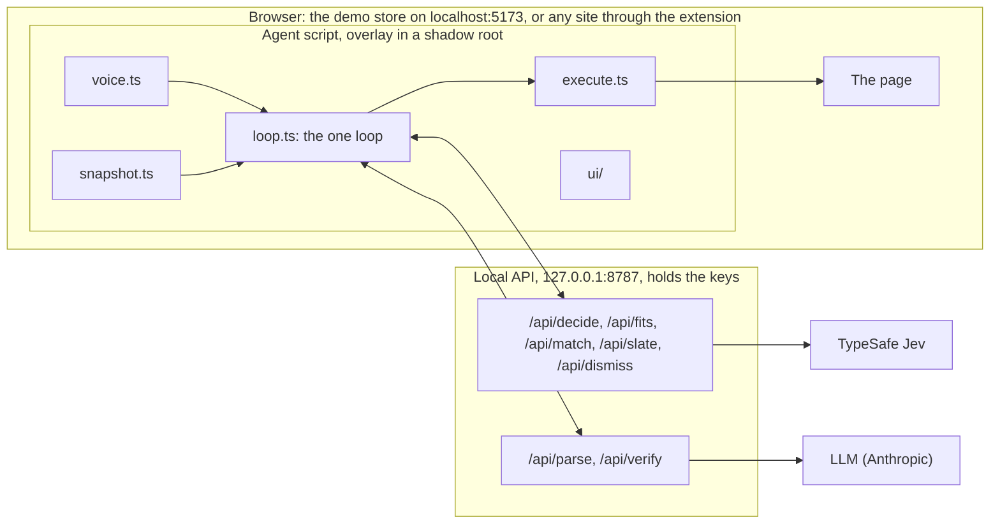

# Tandem

A voice copilot for the web page in front of you. You can **drive** it ("scroll down", "open the second one") and it acts in about the time it takes Chrome to finish hearing you, or **delegate** to it ("find me white sneakers under a hundred dollars") and it works through the page by itself, asks when only you know the answer (your size), remembers what you told it, and hands the page back. On a task it never buys; when you are driving, anything that spends money needs a second, explicit yes.

**Demo video:** _link to be added_

> **Running it needs a TypeSafe API key, and TypeSafe's Jev model is in early access.** If you do not have one, the video is the demo; the rest of this page, `SPEC.md` and `NOTES.md` are the explanation. Everything below "Local setup" assumes a key.

It is a time-boxed prototype, built on 19 and 20 September 2026. `SPEC.md` is the design I wrote before any code, `CLAUDE.md` is the rule file the coding agent worked under, `NOTES.md` is the build diary, including what broke, and `TRIAL.md` is the script for trying it on real sites.

## How it works

**Code calculates. Jev judges. A larger model helps, slowly, at the edges.**

- **Jev** (TypeSafe's System One model) makes every moment-to-moment decision: what kind of utterance this is, which operation, which element, whether to ask, which option matches a spoken answer. One request per decision, all questions in parallel, around 200 ms. It only ever *selects* among the controls the agent saw on the page; nothing it returns becomes a selector, a coordinate, a URL or code.
- **Code** does everything that can be computed: ordinals ("the second one"), prices and price comparison, counting, loop detection, the deny-list, "stop", what a saved answer applies to, which rows of a dense page get sent. All of it is pure functions in `shared/`, unit tested without the network.
- **An LLM** (Claude Haiku by default) runs only at the two ends of a delegated task: it parses a fuzzy request into constraints in the page's own vocabulary, and at the end it verifies the result and writes the one spoken sentence. It is never between your voice and an action; nothing in drive mode calls it, and a test enforces that.
- Drive and delegate are **one loop with two leashes** (one step, or up to twenty-five), not two code paths.
- All of Jev's question wording lives in one file, `shared/questions.ts`. That file is the main tuning surface, and `NOTES.md` records every rewording and what it did to the scores.



The agent knows a page through its DOM alone: `agent/` never imports from `store/`, and the demo store contains no hooks for it. In the extension the content script is the same agent; a background worker proxies its calls to the local API and keeps what must outlive a page load (the running task, the microphone's on/off).

## Requirements

- **Node 22.13 or later, or Node 24** (built on Node 24). The SDK itself runs on 20, but the test runner, jsdom and the dev scripts need 22.
- **Chrome.** Speech recognition is Chrome's `webkitSpeechRecognition`.
- **A TypeSafe API key** (early access).
- **An Anthropic API key, optional.** Without it everything still runs, including price limits said in plain numbers ("under a hundred dollars"), which code reads by itself. What you lose is the parse of a fuzzy request into the page's own categories and filters, the check at the end of a task, and the spoken summary: a task ends with a bare "Your turn."

## Local setup

macOS or Linux:

```bash
git clone <this repository's URL> tandem
cd tandem
npm install
cp .env.example .env        # then open .env and paste your keys
npm run dev
```

Windows PowerShell:

```powershell
git clone <this repository's URL> tandem
cd tandem
npm install
Copy-Item .env.example .env   # then open .env and paste your keys
npm run dev
```

`.env` has four lines: `TYPESAFE_API_KEY`, `JEV_MODEL` (leave `jev-latest`), `ANTHROPIC_API_KEY` (optional), `LLM_MODEL`. It is git-ignored; keys live there and nowhere else.

`npm run dev` starts the local API on `127.0.0.1:8787` and the demo shoe shop, "Footnote", on <http://localhost:5173>. Open that in Chrome, click the microphone in the capsule at the bottom of the page and allow it. Or press `/` and type a command instead of saying it. Press `i` for the inspector, which shows what was heard, what Jev answered, the policy's reason in words, and the timings.

Things to try:

1. "scroll down"
2. "open the second one"
3. "go back"
4. "find me white shoes under a hundred dollars". It checks White, asks "Which size?" with the shop's own sizes (answer "ten and a half", which it saves), sorts by price, dims what costs more than $100, and tells you what it found before handing the page back.
5. "find me black boots". It clears what the last search left behind, uses the saved size without asking, and says so in the trail.

Say "stop" at any time, or press Esc. <http://localhost:5173/?gym=hard> adds a cookie banner, a newsletter pop-up with a guilt-trip decline link, filters behind a disclosure and a custom sort listbox; `?gym=easy` goes back.

```bash
npm test            # 353 unit tests, no network
npm run typecheck
```

The scripts in `scripts/` do call Jev: `bench-decide.ts` measures latency and accuracy by row count, and `probe-heads.ts` saves every production score so a rewording can be compared before and after.

## The Chrome extension

The same agent, on any website.

1. Keep `npm run dev` running: the extension talks to the local API.
2. `npm run build:ext` (writes `extension/dist/content.js` and `extension/dist/background.js`).
3. In Chrome open `chrome://extensions` and switch on **Developer mode** (top right).
4. Click **Load unpacked** and choose this project's `extension` folder (the one with `manifest.json` in it, not `extension/dist`).
5. Pin it: the puzzle-piece icon, then the pin next to "Tandem (local prototype)". It has no icon of its own, so Chrome shows a grey "T".
6. Open a page, for example <https://en.wikipedia.org>, and click the Tandem button. Chrome asks whether it may read and change **that site only**; allow it. The badge turns to `on` and the capsule appears: "Tandem is on for this tab".
7. Click the microphone in the capsule. Chrome asks for the microphone once per site; choose **Allow while visiting the site**, not "Allow this time", or it is forgotten at the next page load. Or press `/` and type.

**It is on per tab and per site.** Moving to a site you have already granted just keeps working, a running task carries on after the page loads, and the microphone comes back by itself ("Listening"). Moving to a site you have not granted **pauses** Tandem and any task: the badge says `off`, one click grants and resumes, and the time spent paused does not count against the task. On a site that has never been given the microphone the capsule says "Click the mic to allow it on this site." rather than making Chrome's prompt jump out at you.

**What to expect on real sites.** In my runs, once the two trial fixes were in, drive commands and the microphone across page loads worked on Wikipedia and Hacker News, and a search task worked on Wikipedia. What breaks is listed under Known limits: grids with no list structure ("the second one" has nothing to count on Nike), unlabelled search boxes (Hacker News), closed shadow roots and iframes, and anything that needs a form filled in, which a task will not do by design. `TRIAL.md` is the script: three drive commands and one task each for Wikipedia, Hacker News and a shop, with what to look for in the inspector.

After changing code: `npm run build:ext`, then the reload arrow on the extension's card, then reload the page you are testing.

**Local network access.** If commands fail with "the Tandem server on this computer is not answering", `npm run dev` is not running. If it is running and calls still fail, check Chrome's **Local network access** setting for the extension (`chrome://extensions`, Details, Site settings): Chrome 142 and later restrict requests to `localhost`, and the documentation does not say clearly whether extensions are exempt.

## Privacy and safety

**Tandem is off until you click its toolbar button, and it is on for that tab only.** While it is off, nothing is injected into any page and nothing is read. No analytics, nothing deployed.

**What is sent where.** On a tab where you turned it on, each command sends a text table of the page's visible controls (names of links, buttons and fields, and what ordinary fields contain), the page's title, headings and status messages (live regions such as a result count or an alert), and its address *without the values in its query string*, to the Tandem server **on your own computer**. That server listens on `127.0.0.1` only, so nothing else on your network can reach it or spend your keys. It sends the table to TypeSafe (Jev) to choose the next action and, for a delegated task, a short digest of the page to Anthropic at the start and at the end. The extension holds no keys and talks to nothing but `localhost:8787`; its background worker, not the page, refuses to forward anything for a tab that is off or paused.

**Speech.** Recognition is Chrome's own, which sends audio to Google while the microphone is on. The agent's voice is Chrome's text-to-speech.

**Rules that are code, not judgement:**

- A password or payment field, payment dropdowns included, is **never read, never typed into and never chosen from**, whoever asks. Its row only ever says "filled". Such fields are recognised by `type=password`, by `autocomplete` (`cc-…`, `current-password` and the like), and by the field's own words (card number, CVV, expiry, password, PIN).
- **Anything that buys, pays, subscribes or checks out** is never pressed on a task. In drive mode, because speech can be misheard, it shows a card ("Click Checkout?") and waits for a second, explicit yes.
- On a task it types only to search, only into a search field, and submits only that search form. It never submits any other form unless your request names the button in so many words ("…and add to cart").
- A cookie banner or pop-up is dismissed only with one of its own controls that refuses or closes. Controls that accept are removed in code before any model sees them, however guilt-trippy the decline link is worded.
- Model output only ever selects among ids from the current snapshot.
- "Stop" is code: the word, Esc or the Stop button halt the loop with no model call, even mid-sentence.

## What was tested, and how

Two different things, and the difference matters.

**By the dev simulator** (`__tandem.say(...)` feeds the same pipeline as the recognizer, echo guard included): each milestone's acceptance checks when it was built (M0 by hand and M1 by typed commands: the simulator arrived with M2), the full store acceptance again after M5 steps 1 to 3, and the core store scenarios after each later fix, all by the coding agent. Its test browser has no microphone and cannot load an extension, so it could never test by voice or in the real extension.

**By real voice in real Chrome, by me:**

- *After M2:* all six drive commands by voice on the store; "stop" on an interim transcript, the "one or two" badges and the echo guard worked; recognition restarted by itself after silence. It found one bug (the search box in the sticky header marked as off screen), fixed in M3.
- *After M3:* the delegate scenario by voice. It found that filters piled up across tasks until a search returned nothing, and that a compound command was routed as a single action and ignored. Both became M3.1.
- *The extension on real sites:* it found that the microphone turned off at every page load (trial fix 1), that "click more" on Hacker News did nothing because the page has 227 controls and only the first 120 were sent (trial fix 2), and that a Nike product could not be clicked because its card stacks three links on top of each other (the fix the next morning). After fix 1 I ran a two-minute check in Chrome (the microphone across page loads, a task resuming after a load, the permission hint on a new site) and it worked; after fix 2 I reported the Hacker News cases working. Both reports were made in the build conversation and are recorded in the last entry of `NOTES.md`.
- *No real-voice result is recorded* for M3.1's fixes, M3b or M4 (accepted by simulator), for the Nike click after its fix, or for the rest of `TRIAL.md`. Accessibility emulation (reduced motion, increased contrast, forced colours) is written to the spec and was **not run**; a contrast script (`scripts/contrast.ts`) checks the colour tokens.

**Measured** (details and tables in `NOTES.md`):

| What | Number |
|---|---|
| End of speech to action, real voice | about 0.6 s, nearly all of it Chrome finalising the transcript (about 610 ms). A speculative decide fires on a stable interim transcript and was ready about 300 ms before the final one; final transcript to action was 2 ms |
| One Jev decision (all heads in one request) | p50 about 210 ms at 120 rows, 261 ms at 240 rows (worst call 379 ms); Jev 171 ms of a 175 ms round trip in the real-voice run |
| Accuracy on the bench, 40 to 240 rows | operation 10/10, target 6/6, typed span 1/1 at every size |
| Cold connection against a warmed one | p50 366 ms against 187 ms, so the agent warms the connection while you speak or type |
| A delegated task on the store | 2.1 s for three actions and DONE (saved size, category, colour) |
| Hacker News front page | 227 usable controls, 175 on screen at once; Jev picks "More" among them at 0.94 |
| Unit tests | 353, none touch the network |

## Known limits

- **There is a short deaf gap while a page loads.** The recognizer lives in the page and dies with it; the next page starts a new one once it has loaded and the worker has told it the microphone was on. What you say in between is lost.
- **Microphone permission is per site, and it goes to the site, not only to Tandem.** Recognition runs inside the page, so Chrome attributes the microphone to the website: every new site asks once, the site itself could then use the microphone too, a site that forbids the microphone in its own policy (`Permissions-Policy: microphone=()`) cannot be listened on at all, and recognition needs an `https` page. See the first item under Next steps.
- **Only the tab you are looking at listens.** Chrome runs one speech-recognition session for the whole browser, so a tab in the background lets go of the microphone and picks it up again when you come back to it.
- **One voice for the whole browser.** The extension speaks with Chrome's own text-to-speech, which is a single queue for every tab. With Tandem on in two tabs, a phrase spoken for the tab in the background can be heard by the recognizer of the tab in front, and Stop or Mute in one tab can cut off what the other was saying. Use the voice in one Tandem tab at a time.
- **Nothing can be shown on a site that has not been granted** (see above); the badge is the only signal.
- **Closed shadow roots and iframes are invisible** to the agent. Open shadow roots are read.
- **Dense pages: 240 controls at most are sent per decision.** At or under that, everything near the viewport; over it, what is on screen is kept first, so a control you can see but that is more than half clipped by the edge of the window, or the last of more than 240 on screen at once, can still be missed, and something off screen that you name from memory may need "scroll down" first. Measured: the Hacker News front page has 227, the top of a long Wikipedia article 197. Decisions on such pages cost more: Hacker News's 227 rows are about 8,700 input tokens as bare rows (`scripts/probe-dense.ts`; Jev answered in 220 to 480 ms), and the real snapshot adds an ordinal or an off-screen mark to about half of them, so expect roughly 10,000 to 12,000; 240 rows shaped like the demo store's are about 19,800 (p50 261 ms). Each row is sent twice (once in the state, once as the label Jev chooses), so a page where nearly all 240 rows carry long names under long headings can pass Jev's limit of 32,000 tokens; every decision on it then fails with "I couldn't reach the model" until you scroll somewhere less dense, or switch the inspector's label style to `ids`, which sends each row once. Housekeeping (clearing filters left from the last search, the page digest for the LLM, dimming) still reads only the first 120 controls of the page, which on a very large page is the header and the side bar.
- **A text field with no label of its own is not recognised as a search box.** Hacker News's is `Search: <input name="q">`, with the word as loose text beside it. Tandem sees the field but not what it is for: on a task it never types there, and "search for rust" in drive mode may type the words and send nothing. Naming a field from the text just before it is about ten lines, and was left out deliberately: it would have been a third fix, and it changes what fields are called on every page.
- **Rows Jev cannot tell apart stay that way.** Hacker News has 30 upvote arrows with no name and 30 links called "hide". Commands aimed at those end in two badges to choose from, or "I can't find that".
- **Several controls stacked for one thing.** A shop's product card is often two or three links on top of each other (Nike: a link stretched over the card, another around the picture, the name underneath). Tandem presses the one on top when it is a real link to the same address, or, where addresses cannot tell, has the same name; never across the edge of a pop-up or a sticky bar. What is still refused: a control under such a link with a different name and no address of its own (the price, the category line).
- **"The second one" needs a list.** Ordinals are counted over repeated siblings. Where a grid is built from plain containers (Nike's is), the page gives Tandem nothing to count, and "open the second one" is a guess.
- **Saved answers are per site,** and every answer to a question Tandem itself asks during a task is saved, whatever it is about; only "Narrow by" answers are filtered for being facts about you. Forget any of them in the memory panel.
- **A page's own modal dialog makes the capsule unclickable** while it is open (the browser makes everything outside a modal inert). Voice still works.
- **A banner whose only button is "OK" or "Got it" stays**, because pressing it usually means consent. An icon-only close button with no accessible name cannot be judged.
- **Each site is its own origin.** `en.wikipedia.org` and `en.m.wikipedia.org` are different sites to Chrome, and so are `http` and `https`. Following a link to a new site pauses Tandem until you click.
- **A task resumes only within 60 seconds** of its last step, and only what was decided survives the page load; the trail of what was done starts again. A task that goes Back into a page Chrome kept in its back/forward cache ends there.
- **The capsule cannot be driven by scripts** on real sites (closed shadow root, made-up events ignored). That is deliberate, and it also means browser-automation tools cannot type into it; use the keyboard, the mouse or your voice.
- **The clean slate** (clearing filters left over from the last search) costs a page load per filter on a site that reloads for every filter: the task starts again on each new page until nothing is left to clear, and each restart parses the request again (about a second).
- **On a task, typing is for searching only.** It will not fill in forms.
- In the demo shop's hard mode, the saved size is not applied while Size is hidden behind "More filters", and code cannot sort by price through the custom listbox.

## Next steps

1. **Move listening out of the page, into a page the extension owns** (an offscreen document, or a side panel). One microphone permission, given to Tandem and not to every website; listening that carries on across page loads, with no deaf gap; and the website never gets the microphone. This is the right fix for the three microphone limits above. Chrome's offscreen documents have a `USER_MEDIA` reason and no time limit for it, but the documentation does not mention speech recognition there, and a permission prompt cannot be shown in an offscreen document (it would have to be granted once from a page of the extension opened in a tab). So: the intended direction, to be prototyped before it is promised.
2. The two failures in the demo shop's hard mode: apply the saved size when Size sits behind "More filters", and sort by price through a custom listbox.
3. Say the counts in code when the LLM is unavailable, instead of ending a task with a bare "Your turn."
4. Name a text field that has no label of its own from the text just before it (`Search: <input name="q">` on Hacker News). Designed and attacked already, about ten lines (NOTES, trial fix 2); left out because both trial fixes were spent.
5. Guard Jev's 32,000-token budget on very dense pages: fall back to the `ids` label style, which sends each row once, when the rows would not fit twice.

## How it was built

I wrote `SPEC.md` first, in a planning conversation with Claude, and `CLAUDE.md`, the rules for the build: one milestone at a time, a short plan before each, my OK, then the build, its acceptance checks, an honest report including what failed, and a commit. **Claude Code wrote the code and the build diary**, so the "I" in `NOTES.md` is Claude and "Sean" is me; the commits carry a `Co-Authored-By` line for it. I made the decisions recorded there (what to cut, which fix to spend, per-site grants instead of either option I was offered), tested by real voice in Chrome between milestones, and reported what broke.

Before M0 (the check of the spec against TypeSafe's documentation) and from M5 on, the coding agent also ran small multi-agent workflows where I asked for them: parallel readers to check facts against Chrome's and TypeSafe's documentation before writing code, independent designs with a sceptic on each before a risky change, and an adversarial review of every finished diff before its commit (finders, then one sceptic per finding trying to refute it). Those reviews found real bugs each time, including a snapshot that would have sent typed passwords to the model once the agent left the demo store (caught in the review of the commit that added the extension, before it ever ran on a real site), and `NOTES.md` says which.

**Time.** The box was about three hours of build time for M0 to M4. Logged build time for M0 to M4 was **1 h 51 min**; on the clock, M0 started at 13:33 and M4 was committed at 16:10, 2 h 37 min including my own testing between milestones, so the specified prototype came in inside the three-hour limit. **M5 (2 h 31 min) and a 19-minute fix the next morning came after the time box**: taking it to the real web was scope I added once M4 was accepted.

| Milestone | What | Logged | |
|---|---|---|---|
| before M0 | the spec checked against the Jev docs and the live API | about 23 min | not a build milestone |
| M0 | scaffold, Jev handshake, the demo store | 14 min | inside the box |
| M1 | see and act: snapshot, decide, policy, command bar, inspector | 18 min | inside |
| M2 | voice: recognizer, simulator, stop, speculative decide, badges | 13 min | inside |
| M3 | delegate: the task leash, asking, memory, hand-back | 17 min | inside |
| M3.1 | fixes from my real-voice run: clean slate, compound commands, never silent, confirm card | 12 min | inside |
| M3b | visual pass: one capsule, the driver frame | 10 min | inside |
| M4 | the LLM at the edges: parse, verify, price in code, dimming | 27 min | inside |
| | **M0 to M4** | **1 h 51 min** | **13:33 to 16:10 on the clock** |
| M5, steps 1 and 2 | de-shop the core, open shadow roots, pop-ups and banners | 51 min | after the box |
| M5, step 3 | the DONE gate, typing on a task, safety rules, the Chrome extension | 45 min | after |
| M5, trial fix 1 | the microphone and the voice across page loads | 34 min | after |
| M5, trial fix 2 | dense pages: 240 rows, what is on screen first | 21 min | after |
| next morning | stacked controls on a real shop (Nike) | 19 min | after |
| | **after the box** | **2 h 50 min** | |

The times are the start and end written into `NOTES.md` as each entry was made, and they agree with the commit timestamps. They are the coding agent's working windows; design work that ran before my go-ahead (about half an hour for trial fix 2) and the check before M0 are outside them; the last entry in `NOTES.md` says so.

### History

The history was rewritten **once, before publication** (2026-09-20), with `git filter-repo`:

- `docs/jev/llms-full.md`, a local copy of TypeSafe's documentation, was removed from every commit. It was in the very first commit, so untracking it later would have left it one click away. It is TypeSafe's, not mine to redistribute; `docs/jev/README.md` says how to download it.
- The author and committer email on every commit was changed to my GitHub no-reply address.

Every commit's author date, committer date, message and `Co-Authored-By` line is unchanged, and every commit's files are otherwise identical; this was verified commit by commit against a record taken before the rewrite. Commit hashes changed, so the one hash cited in the repository (M5 steps 1 and 2, now `2280cc4`) was updated. One unreachable commit left over from amending the first commit minutes after it was made was pruned from the local repository at the same time; it was never part of this history.

## Credits

- **[browser-use/jev-ultrafast](https://github.com/browser-use/jev-ultrafast)** is the design reference for the observe, decide, act loop. **No code from it was read or copied**, and the coding agent never opened the repository. During planning, Claude read that project's README, and the spec borrowed three ideas from it: one request that chooses the operation and its targets together, the rule that model output only selects among observed elements, and the inspector.
- [TypeSafe](https://docs.typesafe.ai) for Jev and its documentation, which is where the habit of splitting a compound question into literal ones and combining them in code comes from.
- Built with Claude Code.

## Troubleshooting

- **The microphone does nothing.** Use Chrome. Click the microphone in the capsule and allow it; on a real site choose "Allow while visiting the site". Recognition needs `https` on real sites (`localhost` is fine). Only the tab you are looking at listens. If the capsule says the microphone is blocked, allow it in Chrome's site settings: a click cannot fix that. Everything also works typed: press `/`.
- **"I couldn't reach the model."** The local API is not running, or a key in `.env` is missing or wrong. `npm run dev` prints the API's errors; <http://localhost:8787/api/health> makes one small Jev call and shows the result.
- **`npm run dev` stops with "Port 5173 is already in use"** (or 8787): another copy is already running.
- **`npm run dev` fails at once on a fresh clone.** `.env` does not exist yet: copy `.env.example` to `.env`.
- **The extension's calls to localhost are blocked.** See "Local network access" above.
- **It acts on the old code after a change to the extension.** Rebuild, reload the extension's card, reload the page.

## Licence

MIT, see `LICENSE`. TypeSafe's documentation is not included and is not covered by it.
